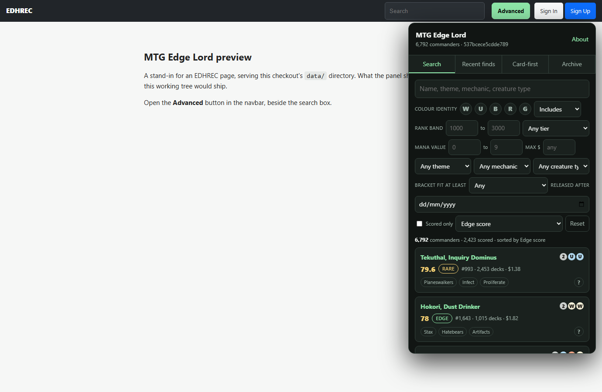
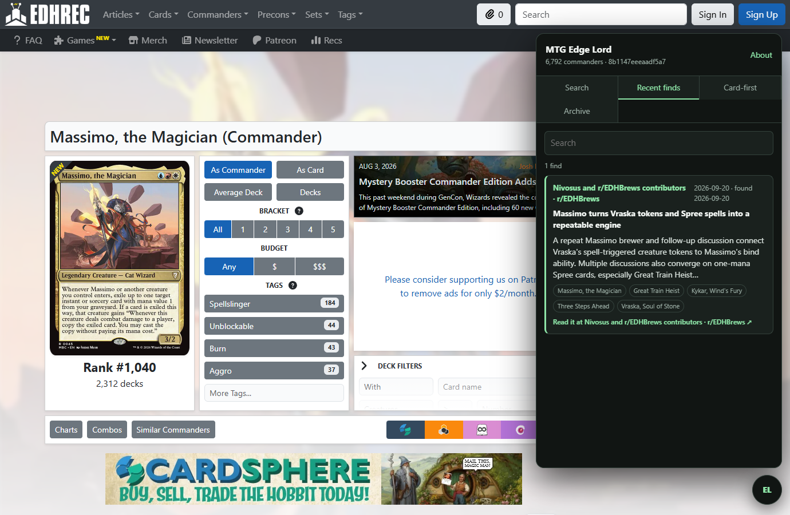
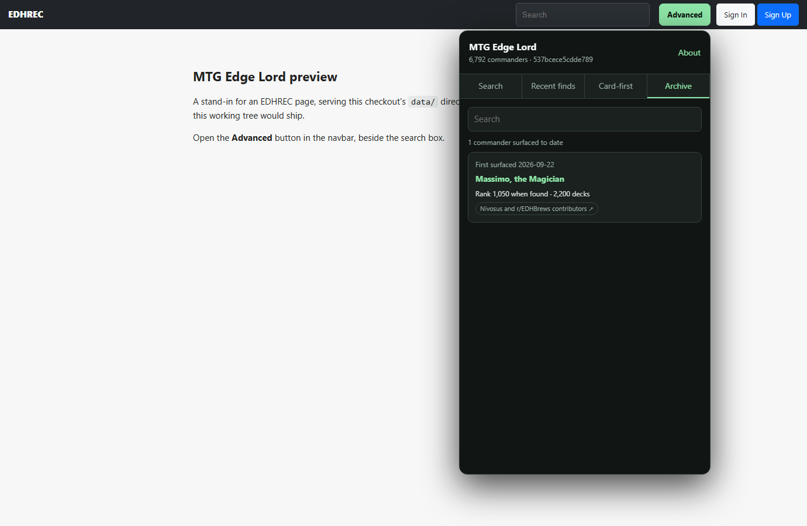

# MTG Edge Lord

MTG Edge Lord is an off-meta Commander discovery layer for [EDHREC](https://edhrec.com), delivered as one Tampermonkey userscript backed by versioned JSON generated in this repository.

It runs as a panel over EDHREC itself. The **Advanced** button in EDHREC's own navbar, between the search box and the account buttons, drops it open on any `edhrec.com` page.



## What it does

**Advanced search.** Filter every Commander by colour identity (exact, includes, at most), mana value, creature type, theme, mechanic, price, bracket fit, release date, and **how off-meta you want to be** — then sort by something other than popularity. EDHREC's own search keeps pulling you back to the top; this one lets you pin yourself to rank 1,000–3,000 and stay there. Popularity is available as a sort option and is never the default.

The Edge score combines obscurity with evidence that the commander actually works: how much of its bracket-tagged pool is built at Bracket 3 or above, whether there is a deep enough high-synergy pool to call it an archetype, and whether deck saves are holding rather than fading after release. A commander with no evidence carries **no score at all**, never a zero.

**Edge Lord discovery.** A daily feed of off-meta commanders that demonstrably work, found by a scheduled job that reads public community sources and judges what it finds. The quality bar is the brand: cool, different, still competitive — not jank.

Every find renders as a digest: enough to decide whether it is worth your time, with the creator credited above it and a canonical link more prominent than anything this project wrote. The point is to send you to their work, not to replace it.



**The archive.** The feed is a moving window, so a find ages out and the commander goes with it. The archive keeps every commander this project has ever surfaced, the date it was surfaced, and the rank it held **when it was found** — which is the interesting number, and the one the feed used to throw away. A commander that was rank 2,400 when we found it and is 700 today is the archive doing its job.



It does not reproduce EDHREC's rankings. It combines obscurity, bracket skew, archetype depth, retention, community reasoning, and momentum to explain why a commander may be a diamond in the rough.

## Install

1. Install Tampermonkey or Violentmonkey.
2. Open [`mtg-edge-lord.user.js`](https://raw.githubusercontent.com/RktRobinhood/MTG-Edge-Lord/main/mtg-edge-lord.user.js).
3. Approve the userscript, then visit any page on `https://edhrec.com`.

Data is cached in the browser. The script checks `data/manifest.json` and refreshes only when `dataVersion` changes; GitHub Pages is preferred and raw GitHub is the fallback.

## Repository map

- `mtg-edge-lord.user.js` — the built, installable userscript. Generated from `src/userscript/`; do not edit it directly.
- `src/userscript/` — the EDHREC panel and the manifest-aware data client.
- `src/connectors/` — isolated source adapters; failures are non-fatal. Scryfall bulk, EDHREC index and page crawl, Archidekt, Commander Spellbook, EDHTop16, cEDH Decklist Database, RSS feeds, YouTube Data API.
- `src/pipeline/` — normalization, scoring, relationship generation, the archive, and publishing.
- `research/inbox/` — reviewed, attributable findings written by hand, and the backlog the daily job adds to.
- `data/` — the generated static backend the userscript fetches, plus `archive.json` and a compact findings history.
- `schema/` — public JSON schemas, enforced by `npm run validate`.
- `state/` — pipeline bookkeeping that must survive between scheduled runs; never published.
- `docs/` — product, architecture, scoring, data, schema, and source policy.
- `.github/workflows/` — daily research build and Pages publication.

## Local development

Requires Node.js 22+.

```powershell
npm install
npm run check
```

Useful commands:

- `npm run research` — deterministic offline build from reviewed inbox data.
- `npm run research:network` — run every connector against the live sources. `-- --pages=N` and `-- --commanders=N` shrink the rotated crawls for a quick local run.
- `npm run build` — bundle `src/userscript/` to the installable root userscript.
- `npm run preview` — serve the built userscript against this checkout's `data/` on <http://localhost:8731>, so a data or UI change can be seen without deploying.
- `npm test` — schema, scoring, normalization, archive, and relationship tests.
- `npm run validate` — verify generated data against schemas and manifest metadata.

Findings are produced by the scheduled daily job. A deterministic pre-filter cuts thousands of candidates to dozens, and a model then judges whether each survivor is genuine brewing effort or a passing mention — reading source **metadata only**, never an article body. Because that output is non-deterministic, the workflow opens a pull request for feed changes rather than pushing them, and **the generated diff is reviewed before it reaches users**. A catalogue refresh, which is deterministic, auto-commits.

Hand-written research is still valid: copy the documented shape into `research/inbox/`, using short factual summaries and canonical links. Never copy a creator's deck guide or substantial prose.

Two lanes need a repository secret to turn on. `YOUTUBE_API_KEY` supplies the interest signal for cohort scoring, and `ANTHROPIC_API_KEY` runs the judgement stage. Without them those lanes disable themselves with a diagnostic and the rest of the build proceeds.

Source access rules, including which sources are deliberately excluded, live in [docs/SOURCES.md](docs/SOURCES.md).

## Product documentation

- [Product requirements](docs/PRD.md)
- [Architecture](docs/ARCHITECTURE.md)
- [Data model](docs/DATA_MODEL.md)
- [Findings schema](docs/FINDINGS_SCHEMA.md)
- [Scoring](docs/SCORING.md)
- [Sources and attribution](docs/SOURCES.md)

Screenshots show the panel running over a live EDHREC page. EDHREC's own layout, card images and card text belong to EDHREC and Wizards of the Coast.

MTG Edge Lord is unofficial fan software and is not affiliated with EDHREC, Wizards of the Coast, or the linked community creators.
