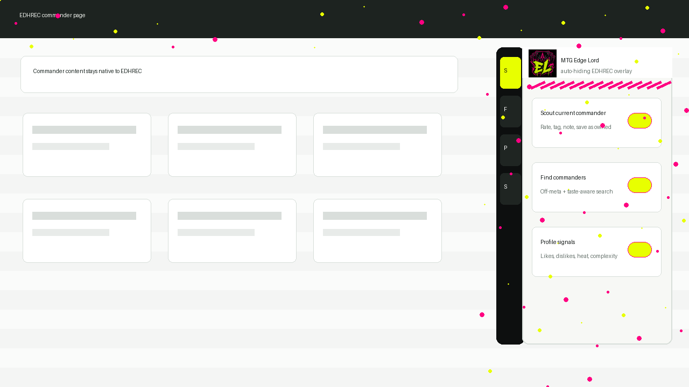

# MTG Edge Lord

MTG Edge Lord is a Chrome extension for EDHREC. It does not replace EDHREC. It adds a graffiti-styled, auto-hiding side rail on `edhrec.com` with commander scouting, off-meta search, saved ideas, and personal deck taste tracking.



## What You Get

- Auto-hiding right-side rail on EDHREC.
- `Scout` panel for the current commander page.
- 1-5 star commander/deck ratings.
- Power, complexity, table heat, speed, and play-pattern tracking.
- Likes, dislikes, tags, and notes per commander.
- `Find` panel that loads EDHREC ranked commanders and sorts by edge, taste, off-meta score, difference, rank, or deck count.
- `Profile` panel that summarizes owned deck habits.
- `Saved` panel for commanders marked while browsing.
- Owned/saved badges added beside EDHREC commander links.

## Install As A Chrome Extension

### 1. Download The Repo

Use either method:

- Click `Code` -> `Download ZIP` on GitHub, then extract the ZIP.
- Or clone it:

```powershell
git clone https://github.com/RktRobinhood/MTG-Edge-Lord.git
```

The folder you need is the repo root, the one containing `manifest.json`.

### 2. Load The Extension

1. Open Chrome.
2. Go to `chrome://extensions`.
3. Turn on `Developer mode` in the top-right corner.
4. Click `Load unpacked`.
5. Select the `MTG-Edge-Lord` folder.
6. Confirm that `MTG Edge Lord for EDHREC` appears in your extensions list.

### 3. Use It On EDHREC

1. Open `https://edhrec.com/commanders`.
2. Open any commander page, for example `https://edhrec.com/commanders/the-ur-dragon`.
3. Look for the narrow black rail on the right side of the page.
4. Hover over it or tab into it to open the panel.
5. Click `Pin` if you want it to stay open.

The toolbar icon also has a small popup with quick links back to EDHREC and the GitHub repo.

## Updating The Extension

If you downloaded a ZIP:

1. Download the latest ZIP.
2. Replace the old extracted folder with the new one.
3. Go to `chrome://extensions`.
4. Click the reload button on `MTG Edge Lord for EDHREC`.

If you cloned with Git:

```powershell
cd MTG-Edge-Lord
git pull
```

Then go to `chrome://extensions` and reload the extension.

## Permissions

The extension asks for:

- `https://edhrec.com/*` so it can add the side panel to EDHREC.
- `https://json.edhrec.com/*` so the `Find` panel can load EDHREC ranked commander JSON.

It stores your saved commanders, ratings, and profile data locally in your browser.

## Troubleshooting

### The rail does not appear

- Confirm the extension is enabled at `chrome://extensions`.
- Reload the EDHREC tab.
- Make sure you are on `https://edhrec.com/*`, not a cached or embedded copy.
- Check that you loaded the folder containing `manifest.json`.

### The Find panel is empty

Open the side rail, go to `Find`, and click `Load EDHREC commanders`. The extension stores the loaded commander index locally after that.

### The Find panel still will not load

Version `0.3.1` routes EDHREC JSON loading through the extension background worker. After pulling the update, reload the extension in `chrome://extensions`, then refresh EDHREC before trying again.

### The current commander looks wrong after navigating EDHREC

Reload the EDHREC tab after updating the extension. Version `0.3.1` re-reads EDHREC route changes and delayed page content, but Chrome still needs the extension reloaded from `chrome://extensions` after local file changes.

### Changes do not show after editing files

Go to `chrome://extensions` and click reload on the extension. Then refresh EDHREC.

### Can this run from GitHub Pages alone?

No. GitHub Pages can host the extension files, but it cannot inject code into `edhrec.com`. Browsers isolate websites by origin. The Chrome extension is what grants permission to run the overlay on EDHREC.

## Optional Userscript Install

If you prefer Tampermonkey or Violentmonkey, open:

```text
https://rktrobinhood.github.io/MTG-Edge-Lord/overlay/edhrec-companion.user.js
```

The Chrome extension path is recommended because it includes the toolbar popup and packaged icon assets.

## Project Files

- `manifest.json` - Chrome extension configuration.
- `overlay/edhrec-companion.user.js` - EDHREC content-script overlay.
- `extension/popup.html` - toolbar popup.
- `extension/popup.css` - toolbar popup styling.
- `assets/icons/` - generated graffiti icon assets.
- `assets/screens/overlay-preview.png` - preview image.
- `index.html` - GitHub Pages install page.
